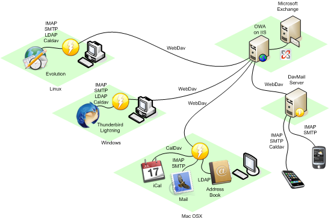

# DavMail POP/IMAP/SMTP/Caldav/Carddav/LDAP Exchange and Office 365 Gateway

**_Security note:_** DavMail does not depend on Log4J2 and is thus not vulnerable to [CVE-2021-44228](https://github.com/advisories/GHSA-jfh8-c2jp-5v3q)

Ever wanted to get rid of Outlook ? DavMail is a POP/IMAP/SMTP/Caldav/Carddav/LDAP gateway allowing users to use any mail client with Exchange, even from the internet through Outlook Web Access on any platform, tested on MacOSX, Linux and Windows

Main project site is still on Sourceforge at http://davmail.sourceforge.net/.

This git repository is synchronized with subversion repository in order to make contributions easier for Github users.

## Donate

Donations are welcome to help support DavMail development, in dollars 

or Euros

## Download
Download latest DavMail release on Sourceforge

RPM packages are available from OpenSuse build service:

An alternative is COPR on Fedora:

Docker images are available on Github Container Registry:

[Detailed Docker instructions](https://github.com/mguessan/davmail/tree/master/src/docker/README.md)

## Trunk builds
Latest working builds are now available on Appveyor:

* Windows 64 bits setup [davmail-6.4.0-trunk-setup64.exe](https://ci.appveyor.com/api/projects/mguessan/davmail/artifacts/dist%2Fdavmail-6.4.0-trunk-setup64.exe?job=Environment%3A%20JAVA_HOME%3DC%3A%5CProgram%20Files%5CJava%5Cjdk1.8.0)
* Windows noinstall package [davmail-6.4.0-trunk-windows-noinstall.zip](https://ci.appveyor.com/api/projects/mguessan/davmail/artifacts/dist%2Fdavmail-6.4.0-trunk-windows-noinstall.zip?job=Environment%3A%20JAVA_HOME%3DC%3A%5CProgram%20Files%5CJava%5Cjdk1.8.0)
* Windows standalone (with embedded Azul JRE-FX) package [davmail-6.4.0-trunk-windows-standalone.zip](https://ci.appveyor.com/api/projects/mguessan/davmail/artifacts/dist%2Fdavmail-6.4.0-trunk-windows-standalone.zip?job=Environment%3A%20JAVA_HOME%3DC%3A%5CProgram%20Files%5CJava%5Cjdk1.8.0)

* Platform independent package [davmail-6.4.0-trunk.zip](https://ci.appveyor.com/api/projects/mguessan/davmail/artifacts/dist%2Fdavmail-6.4.0-trunk.zip?job=Environment%3A%20JAVA_HOME%3DC%3A%5CProgram%20Files%5CJava%5Cjdk1.8.0)

* Debian package [davmail_6.4.0-trunk-1_all.deb](https://ci.appveyor.com/api/projects/mguessan/davmail/artifacts/dist%2Fdavmail_6.4.0-trunk-1_all.deb?job=Environment%3A%20JAVA_HOME%3DC%3A%5CProgram%20Files%5CJava%5Cjdk1.8.0)

* OSX application [DavMail-MacOSX-6.4.0-trunk.app.zip](https://ci.appveyor.com/api/projects/mguessan/davmail/artifacts/dist%2FDavMail-MacOSX-6.4.0-trunk.app.zip?job=Environment%3A%20JAVA_HOME%3DC%3A%5CProgram%20Files%5CJava%5Cjdk1.8.0)

## Contribute
Contributions are welcome, you can either [submit a patch](https://sourceforge.net/p/davmail/patches/) or create a [Github pull request](https://github.com/mguessan/davmail/pulls).

In case you are looking for tasks to work on, please check current
[Backlog](https://sourceforge.net/p/davmail/feature-requests/milestone/Backlog/).

